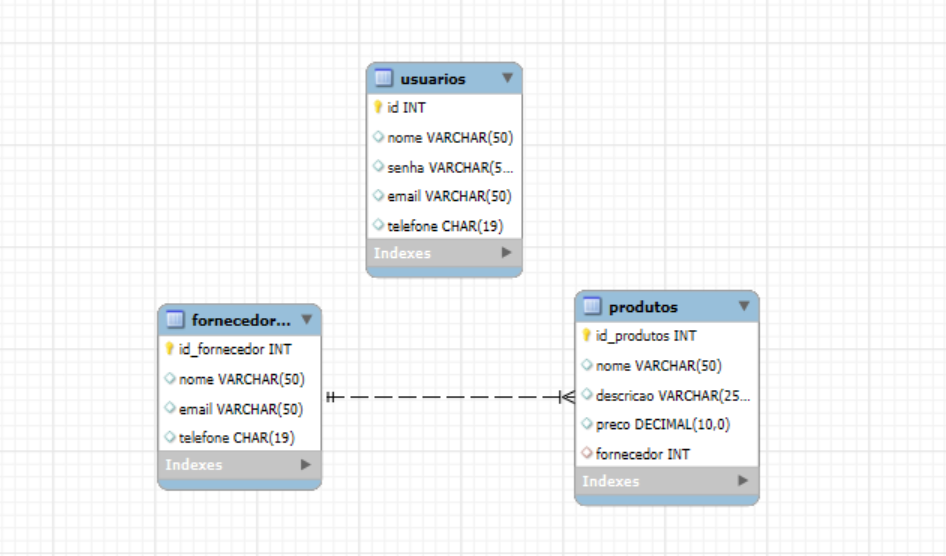
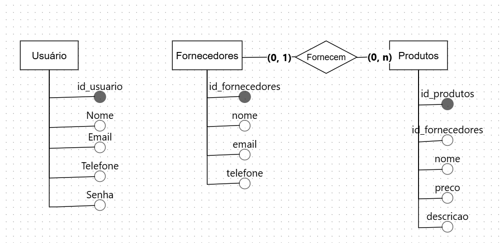
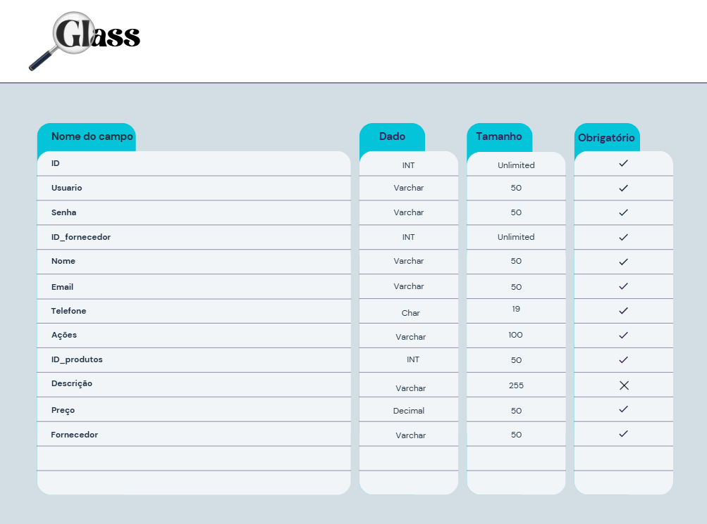

# **`Sprint 2 - Banco de Dados Natura 💻🟩🌷`**

#### O documento exibe toda o conteúdo produzido durante a Sprint 2 - Banco de dados 💻🖥️🟩 ####
##### ✏️🗒️ Contendo tópicos como prototipos, códigos e termos específicos como MER e DER 🗒️✏️ #####

 
  
<h2>Informações relevantes ‼️</h2>

  ---

  
  

---

